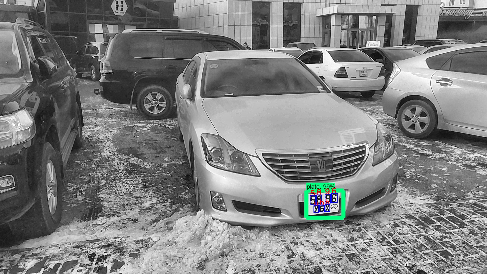

# Mongolian-ALPR
Automated License Plate Recognition for Mongolian vehicle

# Introduction 
This repository implements two-stage ALPR (Automated License Plate Recognition) on about 600+ images of 
Mongolian vehicles.
- First stage being detecting the license plate
- Second stage is finding and recognizing characters from the detected license plate

Used [Tensorflow Object Detection API](https://github.com/tensorflow/models/tree/master/research/object_detection) 
for detecting the license plate.
Speed is important in ALPR because vehicles are usually on the move.
I chose pretrained models based on SSD (Single Shot Detector) and Faster RCNN (Region based Convolutional Neural Network)
algorithms since they enjoy a higher speed than other object detection algorithms and only getting beaten by 
algorithms such as YOLO (You Only Look Once). But didn't find any pretrained model based on YOLO from Tensorflow Object 
Detection API.

Couldn't train a machine learning model to detect characters for a second stage due to small dataset of images.
Some characters act as a location identifier so they are found in images more than other characters which leads to 
imbalance in a characters dataset. Even then, each character on average had occurred in 20 vehicle images from the whole 
dataset of 600+ images. Also, image labeling task was tedious. So I resorted for a more traditional
image processing methods.

First did some [shadow removal](https://stackoverflow.com/questions/44752240/how-to-remove-shadow-from-scanned-images-using-opencv)
from the
detected plate image. Then used adaptive histogram equalization for more dynamic range. And finally turned the plate
image into a binary image and found label masks by connecting same components. It produces many masks including
the characters. After removing some of it based on size and ratio we end up with masks that have a very high
potential to be characters. Now we turn the masks into bounding boxes and crop them out from the plate image.
I trained a simple CNN (Convolutional Neural Network) similar to [MNIST example](https://keras.io/examples/mnist_cnn/) 
on Keras documentation. Augmented character images (200 images from each character) to train the CNN. 
Then ran the model on cropped bounding boxes and it's done.

Currently it has a score of 66-72 mAP (mean average precision) for plate detection.

And the character recognition of license plate is heavily dependant from plate type, camera angle and ambient lights. So
the exact accuracy is hard to evaluate.

To upgrade it needs to have an object detection model which can detect and classify characters from a plate image like a first stage
since the second stage is the current bottleneck of this system. In short, it needs more data.

  

# Let's take it for a test drive

## Requirements
- Python 3 packages: tensorflow, opencv, numpy, matplotlib, skimage, imutils (all the dependencies are in **"requirements.txt"** file)
1. Clone this repository somewhere

2. Download and extract [exported_model_directory](https://drive.google.com/open?id=1-mUz2QQU-V7KtlPhV0M1bi-Hj8x1QgKq)
inside the repository
3. Put your images into "mongol_alpr_images". You can start with the given test images.

4. Run "test_exported_model.ipynb" on jupyter notebook. Outputs will be written into "mongol_alpr_output" directory.

I already put first 30 outputs with and without preprocessing(light enhancement) in order to demonstrate how it affects the performance.
You can tweak the code and load in different models from "exported_model_directory".

If you run into problems check out [Tensorflow Object Detection API](https://github.com/tensorflow/models/tree/master/research/object_detection) and try to setup your environments accordingly.
